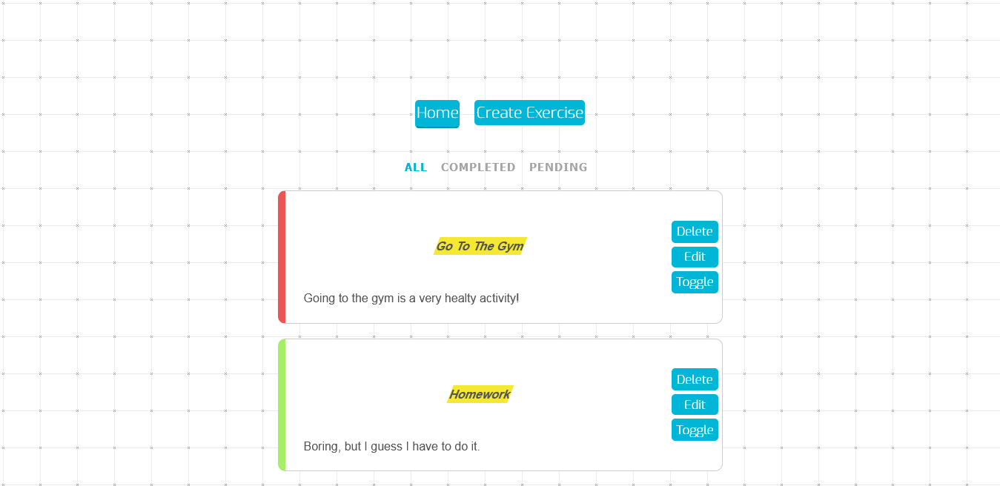
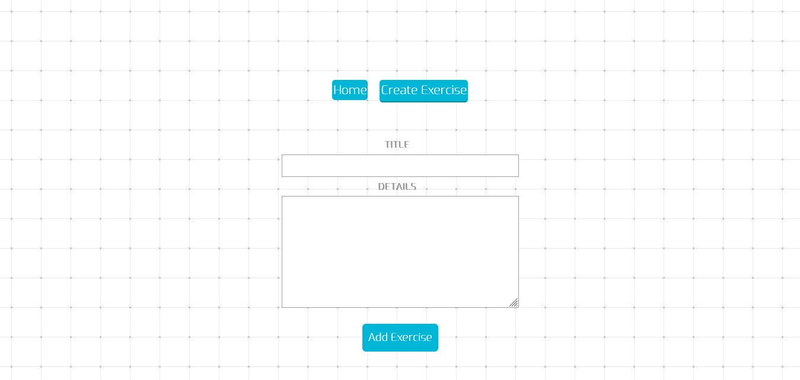
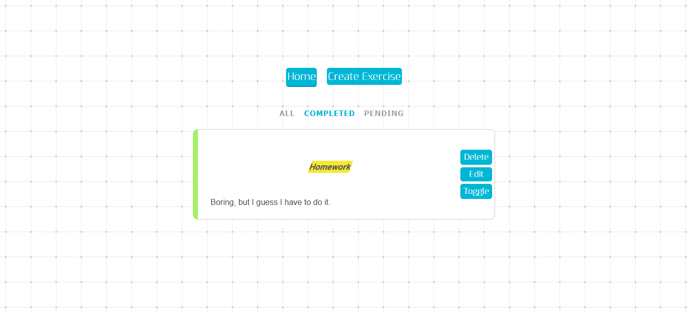
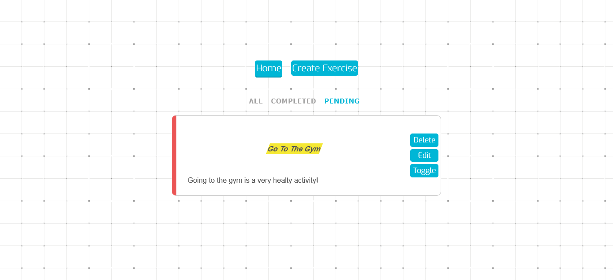

 

# Exercise Planner

Plan your daily activities!

Create new exercises

Filter to only see those that you have completed

Or those you havent

## Live version

Not availiable yet!

## DB

This webApp is using Local Storage as database, you can close the browser and reopen it, your exercises will still be there

## Contributing 🖇️

Any contributions are highly appreciated. There are two things you can do:

1. Create an issue explaining your idea.
2. Fork the project and submit a Pull Request with your idea already developed explaining it in detail.

⌨️ with ❤️ by [Ukliz](https://github.com/Uklizdev) 😊
